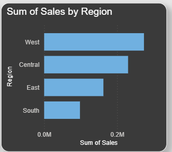

# 📊 Power BI Sales Performance Dashboard

An interactive Power BI dashboard designed to analyze sales performance across regions, product categories, and customer segments, enabling data-driven business decisions.

---

## 🔍 Project Objective
The objective of this project is to transform raw sales data into meaningful insights that help answer critical business questions related to revenue, profitability, and customer behavior.

---

## ❓ Business Questions Answered
- Which regions and states contribute the most to total sales?
- Which product categories and sub-categories are underperforming?
- How do sales and profit trends change over time?
- Which customer segments generate the highest revenue and profit?

---

## 📈 Key Insights
- The West region contributes the highest overall sales, with California being the top-performing state.
- Technology products generate higher profit margins compared to Office Supplies.
- Certain sub-categories show high sales volume but low profitability, indicating cost or pricing inefficiencies.
- Customers aged 46–55 contribute higher average sales per order.

---

## 🖥 Dashboard Preview

### Sales Overview

### Regional Performance

### Product & Customer Insights

---

## 🛠 Tools & Technologies
- Power BI Desktop
- Power Query (Data Cleaning & Transformation)
- DAX (Calculated Measures & KPIs)
- Microsoft Excel (Dataset)

---

## ⚙ Technical Highlights
- Created interactive visuals using slicers and filters
- Built calculated measures for Sales, Profit, and Profit Margin using DAX
- Designed drill-through and tooltip-enabled visuals
- Applied a clean and consistent dashboard theme for better readability

---

## 🚀 Future Enhancements
- Add YoY and MoM growth metrics using advanced DAX
- Implement sales forecasting using time-series analysis
- Connect live SQL database instead of Excel
- Publish dashboard to Power BI Service with scheduled refresh

---

## 📌 How to Use
1. Download the `.pbix` file from the Dashboard folder
2. Open it using Power BI Desktop
3. Use slicers to explore insights across regions, categories, and customer segments
